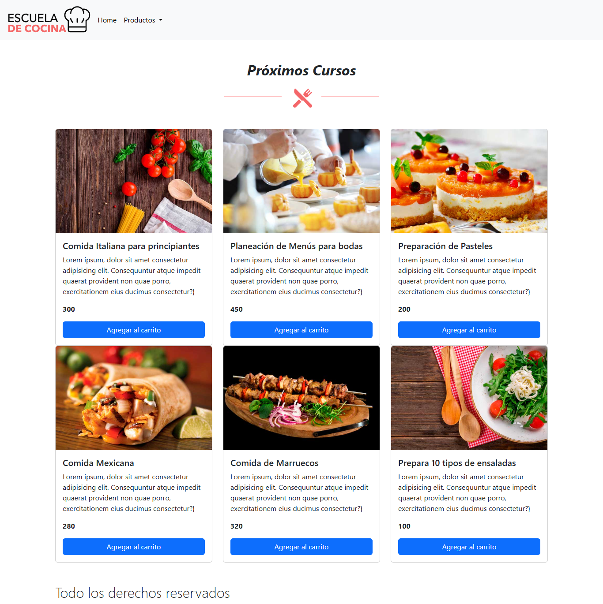

# 🛒 Proyecto: Carrito de Compras con JavaScript Vanilla

Este proyecto consiste en una aplicación web donde los usuarios pueden agregar productos a un carrito de compras de manera dinámica. Está desarrollado con **HTML, CSS y JavaScript puro (Vanilla JS)**, sin frameworks externos.

## 🧠 Lo que aprendí:
- Manipulación avanzada del DOM
- Gestión del carrito (añadir, eliminar, vaciar productos)
- Uso de eventos como `click` y `DOMContentLoaded`
- Manejo de localStorage para persistir el carrito entre sesiones
- Separación del código en funciones reutilizables y ordenadas

## 📦 Funcionalidades:
- Agregar productos al carrito
- Eliminar productos individuales
- Vaciar el carrito por completo
- Actualización automática de la lista de productos y del total
- Persistencia de datos con `localStorage`

## 🌐 Enlace al proyecto:
[🔗 Ver proyecto en Netlify](https://carts-carrito.netlify.app/)
---

## 📷 Vista previa del proyecto




---

## 🛠️ Tecnologías usadas

| Tecnología        | Descripción                        |
|------------------|------------------------------------|
| 💻 HTML + CSS    | Estructura y estilos básicos       |
| 🎨 Bootstrap     | Maquetación responsiva y componentes |
| 🧠 JavaScript    | Lógica del carrito (Vanilla JS)    |
| 📦 JSON local    | Fuente de datos de los cursos      |
| 📍 LocalStorage  | Persistencia del carrito en navegador |
| 🚨 SweetAlert2   | Alertas visuales personalizadas    |

---

## 🧪 ¿Cómo usarlo?

Clona este repositorio:  
   ```bash
    git clone https://github.com/KeniaKodigo/vanilla-js-course-cart.git
